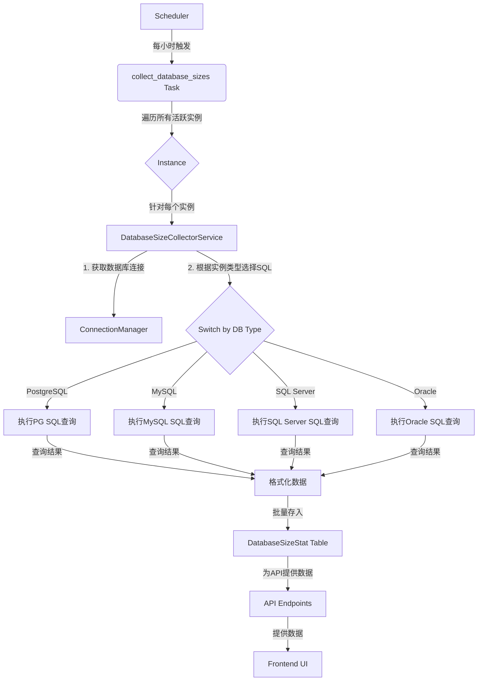
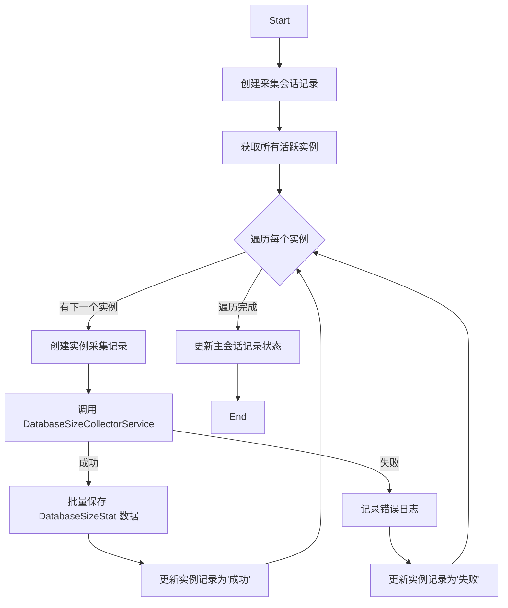

# 功能技术规格：数据库大小监控与分析

## 1. 功能概述

本功能旨在为 TaifishingV4 平台提供一个全面的数据库大小监控与分析解决方案。通过定期采集、存储和分析各数据库实例下每个具体数据库的大小信息（包括数据文件和日志文件），帮助用户有效管理存储资源、预测增长趋势、优化数据库性能，并为容量规划提供数据支持。

## 2. 架构整合设计

我们将采用一个与现有 `sync_accounts` 任务类似的异步任务处理模式，以确保数据采集过程的高效、可靠和非阻塞。



- **任务调度 (Scheduler)**: 复用现有的 `apscheduler`，添加一个新的定时任务 `collect_database_sizes`。
- **后台任务 (Task)**: 在 `app/tasks.py` 中创建 `collect_database_sizes` 任务，负责编排整个采集流程。
- **核心服务 (Service)**: 在 `app/services` 中创建 `DatabaseSizeCollectorService`，封装所有与数据库大小采集相关的业务逻辑。
- **数据模型 (Model)**: 在 `app/models` 中创建新的 `DatabaseSizeStat` 模型，用于持久化存储采集到的数据。
- **API层**: 在 `app/controllers` 中添加新的路由，提供数据查询接口。
- **前端 (UI)**: 在前端项目中修改相关页面，调用API并以图表和表格形式展示数据。

## 3. 数据模型设计

### 3.1. `DatabaseSizeStat` 模型

我们将创建一个新的 SQLAlchemy 模型 `DatabaseSizeStat` 来存储每个数据库在特定时间点的大小信息。

```python
# app/models/database_size_stat.py

from sqlalchemy import (
    Column,
    Integer,
    String,
    DateTime,
    Date,
    ForeignKey,
    BigInteger,
    Index,
    UniqueConstraint,
)
from sqlalchemy.orm import relationship
from app.models.base import Base
import datetime


class DatabaseSizeStat(Base):
    """
    存储每个数据库在特定时间点的大小统计信息。
    支持 PostgreSQL 分区表，按日期分区。
    """

    __tablename__ = "database_size_stats"

    id = Column(BigInteger, primary_key=True, index=True)
    instance_id = Column(Integer, ForeignKey("instances.id"), nullable=False)
    database_name = Column(String(255), nullable=False, comment="数据库名称")
    size_mb = Column(BigInteger, nullable=False, comment="数据库总大小（MB）")
    data_size_mb = Column(
        BigInteger, nullable=True, comment="数据部分大小（MB），如果可获取"
    )
    log_size_mb = Column(
        BigInteger, nullable=True, comment="日志部分大小（MB），如果可获取（SQL Server）"
    )
    collected_date = Column(Date, nullable=False, comment="采集日期（用于分区）")
    collected_at = Column(
        DateTime, nullable=False, default=datetime.datetime.utcnow, comment="采集时间戳"
    )
    created_at = Column(
        DateTime, nullable=False, default=datetime.datetime.utcnow, comment="记录创建时间"
    )

    instance = relationship("Instance", back_populates="database_size_stats")

    __table_args__ = (
        # 分区表约束
        Index(
            "ix_database_size_stats_collected_date",
            "collected_date",
        ),
        # 每日唯一性约束
        UniqueConstraint(
            "instance_id",
            "database_name", 
            "collected_date",
            name="uq_daily_database_size"
        ),
        # 查询优化索引
        Index(
            "ix_database_size_stats_instance_date",
            "instance_id",
            "collected_date",
        ),
    )

    def __repr__(self):
        return f"<DatabaseSizeStat(id={self.id}, instance_id={self.instance_id}, db='{self.database_name}', size_mb={self.size_mb}, date={self.collected_date})>"


class DatabaseSizeAggregation(Base):
    """
    数据库大小聚合统计表
    存储每周、每月、每季度的统计信息
    """
    
    __tablename__ = "database_size_aggregations"
    
    id = Column(BigInteger, primary_key=True, index=True)
    instance_id = Column(Integer, ForeignKey("instances.id"), nullable=False)
    database_name = Column(String(255), nullable=False, comment="数据库名称")
    
    # 统计周期
    period_type = Column(String(20), nullable=False, comment="统计周期类型：weekly, monthly, quarterly")
    period_start = Column(Date, nullable=False, comment="统计周期开始日期")
    period_end = Column(Date, nullable=False, comment="统计周期结束日期")
    
    # 统计指标
    avg_size_mb = Column(BigInteger, nullable=False, comment="平均大小（MB）")
    max_size_mb = Column(BigInteger, nullable=False, comment="最大大小（MB）")
    min_size_mb = Column(BigInteger, nullable=False, comment="最小大小（MB）")
    data_count = Column(Integer, nullable=False, comment="统计的数据点数量")
    
    # 数据大小统计（如果可获取）
    avg_data_size_mb = Column(BigInteger, nullable=True, comment="平均数据大小（MB）")
    max_data_size_mb = Column(BigInteger, nullable=True, comment="最大数据大小（MB）")
    min_data_size_mb = Column(BigInteger, nullable=True, comment="最小数据大小（MB）")
    
    # 日志大小统计（SQL Server）
    avg_log_size_mb = Column(BigInteger, nullable=True, comment="平均日志大小（MB）")
    max_log_size_mb = Column(BigInteger, nullable=True, comment="最大日志大小（MB）")
    min_log_size_mb = Column(BigInteger, nullable=True, comment="最小日志大小（MB）")
    
    
    # 时间字段
    calculated_at = Column(DateTime, nullable=False, default=datetime.datetime.utcnow, comment="计算时间")
    created_at = Column(DateTime, nullable=False, default=datetime.datetime.utcnow, comment="记录创建时间")
    
    instance = relationship("Instance", back_populates="database_size_aggregations")
    
    __table_args__ = (
        # 唯一约束
        UniqueConstraint(
            "instance_id",
            "database_name",
            "period_type",
            "period_start",
            name="uq_database_size_aggregation"
        ),
        # 查询优化索引
        Index(
            "ix_database_size_aggregations_instance_period",
            "instance_id",
            "period_type",
            "period_start",
        ),
        Index(
            "ix_database_size_aggregations_period_type",
            "period_type",
            "period_start",
        ),
    )

    def __repr__(self):
        return f"<DatabaseSizeAggregation(id={self.id}, instance_id={self.instance_id}, db='{self.database_name}', period={self.period_type}, avg={self.avg_size_mb})>"

```

### 3.2. 扩展 `Instance` 模型

在 `app/models/instance.py` 的 `Instance` 模型中添加反向关系。

```python
# app/models/instance.py
# ... other imports
from sqlalchemy.orm import relationship

class Instance(Base):
    # ... existing columns
    database_size_stats = relationship(
        "DatabaseSizeStat",
        back_populates="instance",
        cascade="all, delete-orphan",
    )
    database_size_aggregations = relationship(
        "DatabaseSizeAggregation",
        back_populates="instance",
        cascade="all, delete-orphan",
    )
    # ... rest of the class
```

## 4. 业务逻辑层设计

### 4.1. `DatabaseSizeCollectorService` - 数据采集服务

该服务将是数据采集的核心，负责处理不同数据库类型的查询逻辑。

### 4.2. `DatabaseSizeAggregationService` - 统计聚合服务

该服务负责计算每周、每月、每季度的统计聚合数据。

```python
# app/services/database_size_aggregation_service.py

from datetime import datetime, date, timedelta
from typing import List, Dict, Any
from sqlalchemy import func, and_, or_
from app.models.database_size_stat import DatabaseSizeStat
from app.models.database_size_aggregation import DatabaseSizeAggregation
from app.models.instance import Instance
from app import db
import logging

logger = logging.getLogger(__name__)


class DatabaseSizeAggregationService:
    """数据库大小统计聚合服务"""
    
    def __init__(self):
        self.period_types = ['weekly', 'monthly', 'quarterly']
    
    def calculate_all_aggregations(self) -> Dict[str, Any]:
        """计算所有实例的统计聚合数据"""
        results = {
            'weekly': self.calculate_weekly_aggregations(),
            'monthly': self.calculate_monthly_aggregations(),
            'quarterly': self.calculate_quarterly_aggregations()
        }
        return results
    
    def calculate_weekly_aggregations(self) -> Dict[str, Any]:
        """计算每周统计聚合"""
        logger.info("开始计算每周统计聚合...")
        
        # 获取上周的数据
        end_date = date.today()
        start_date = end_date - timedelta(days=7)
        
        return self._calculate_aggregations('weekly', start_date, end_date)
    
    def calculate_monthly_aggregations(self) -> Dict[str, Any]:
        """计算每月统计聚合"""
        logger.info("开始计算每月统计聚合...")
        
        # 获取上个月的数据
        today = date.today()
        if today.month == 1:
            start_date = date(today.year - 1, 12, 1)
            end_date = date(today.year - 1, 12, 31)
        else:
            start_date = date(today.year, today.month - 1, 1)
            end_date = date(today.year, today.month, 1) - timedelta(days=1)
        
        return self._calculate_aggregations('monthly', start_date, end_date)
    
    def calculate_quarterly_aggregations(self) -> Dict[str, Any]:
        """计算每季度统计聚合"""
        logger.info("开始计算每季度统计聚合...")
        
        # 获取上个季度的数据
        today = date.today()
        quarter = (today.month - 1) // 3 + 1
        
        if quarter == 1:
            # 上个季度是去年Q4
            start_date = date(today.year - 1, 10, 1)
            end_date = date(today.year - 1, 12, 31)
        else:
            # 上个季度是今年Q(quarter-1)
            quarter_start_month = (quarter - 2) * 3 + 1
            start_date = date(today.year, quarter_start_month, 1)
            end_date = date(today.year, quarter_start_month + 2, 1) - timedelta(days=1)
        
        return self._calculate_aggregations('quarterly', start_date, end_date)
    
    def _calculate_aggregations(self, period_type: str, start_date: date, end_date: date) -> Dict[str, Any]:
        """计算指定周期的统计聚合"""
        try:
            # 获取所有活跃实例
            instances = Instance.query.filter_by(is_active=True).all()
            
            total_processed = 0
            total_errors = 0
            
            for instance in instances:
                try:
                    # 获取该实例在指定时间范围内的数据
                    stats = DatabaseSizeStat.query.filter(
                        DatabaseSizeStat.instance_id == instance.id,
                        DatabaseSizeStat.collected_date >= start_date,
                        DatabaseSizeStat.collected_date <= end_date
                    ).all()
                    
                    if not stats:
                        continue
                    
                    # 按数据库分组计算统计
                    db_groups = {}
                    for stat in stats:
                        db_name = stat.database_name
                        if db_name not in db_groups:
                            db_groups[db_name] = []
                        db_groups[db_name].append(stat)
                    
                    # 为每个数据库计算统计聚合
                    for db_name, db_stats in db_groups.items():
                        self._calculate_database_aggregation(
                            instance.id, db_name, period_type, 
                            start_date, end_date, db_stats
                        )
                    
                    total_processed += 1
                    
                except Exception as e:
                    logger.error(f"处理实例 {instance.id} 的统计聚合时出错: {str(e)}")
                    total_errors += 1
                    continue
            
            return {
                'status': 'success',
                'period_type': period_type,
                'start_date': start_date.isoformat(),
                'end_date': end_date.isoformat(),
                'total_instances': len(instances),
                'processed_instances': total_processed,
                'errors': total_errors
            }
            
        except Exception as e:
            logger.error(f"计算 {period_type} 统计聚合时出错: {str(e)}")
            return {
                'status': 'error',
                'period_type': period_type,
                'error': str(e)
            }
    
    def _calculate_database_aggregation(self, instance_id: int, database_name: str, 
                                      period_type: str, start_date: date, end_date: date, 
                                      stats: List[DatabaseSizeStat]) -> None:
        """计算单个数据库的统计聚合"""
        try:
            # 计算基本统计
            sizes = [stat.size_mb for stat in stats]
            data_sizes = [stat.data_size_mb for stat in stats if stat.data_size_mb is not None]
            log_sizes = [stat.log_size_mb for stat in stats if stat.log_size_mb is not None]
            
            # 检查是否已存在该周期的聚合数据
            existing = DatabaseSizeAggregation.query.filter(
                DatabaseSizeAggregation.instance_id == instance_id,
                DatabaseSizeAggregation.database_name == database_name,
                DatabaseSizeAggregation.period_type == period_type,
                DatabaseSizeAggregation.period_start == start_date
            ).first()
            
            if existing:
                # 更新现有记录
                aggregation = existing
            else:
                # 创建新记录
                aggregation = DatabaseSizeAggregation(
                    instance_id=instance_id,
                    database_name=database_name,
                    period_type=period_type,
                    period_start=start_date,
                    period_end=end_date
                )
            
            # 更新统计指标
            aggregation.avg_size_mb = int(sum(sizes) / len(sizes))
            aggregation.max_size_mb = max(sizes)
            aggregation.min_size_mb = min(sizes)
            aggregation.data_count = len(stats)
            
            # 数据大小统计
            if data_sizes:
                aggregation.avg_data_size_mb = int(sum(data_sizes) / len(data_sizes))
                aggregation.max_data_size_mb = max(data_sizes)
                aggregation.min_data_size_mb = min(data_sizes)
            
            # 日志大小统计（SQL Server）
            if log_sizes:
                aggregation.avg_log_size_mb = int(sum(log_sizes) / len(log_sizes))
                aggregation.max_log_size_mb = max(log_sizes)
                aggregation.min_log_size_mb = min(log_sizes)
            
            aggregation.calculated_at = datetime.utcnow()
            
            if not existing:
                db.session.add(aggregation)
            
            db.session.commit()
            
        except Exception as e:
            logger.error(f"计算数据库 {database_name} 的 {period_type} 统计聚合时出错: {str(e)}")
            db.session.rollback()
            raise
    
    def get_aggregations(self, instance_id: int, period_type: str, 
                        start_date: date = None, end_date: date = None,
                        database_name: str = None) -> List[Dict[str, Any]]:
        """获取统计聚合数据"""
        query = DatabaseSizeAggregation.query.filter(
            DatabaseSizeAggregation.instance_id == instance_id,
            DatabaseSizeAggregation.period_type == period_type
        )
        
        if start_date:
            query = query.filter(DatabaseSizeAggregation.period_start >= start_date)
        if end_date:
            query = query.filter(DatabaseSizeAggregation.period_end <= end_date)
        if database_name:
            query = query.filter(DatabaseSizeAggregation.database_name == database_name)
        
        aggregations = query.order_by(DatabaseSizeAggregation.period_start.desc()).all()
        
        return [self._format_aggregation(agg) for agg in aggregations]
    
    def _format_aggregation(self, aggregation: DatabaseSizeAggregation) -> Dict[str, Any]:
        """格式化聚合数据"""
        return {
            'database_name': aggregation.database_name,
            'period_type': aggregation.period_type,
            'period_start': aggregation.period_start.isoformat(),
            'period_end': aggregation.period_end.isoformat(),
            'statistics': {
                'avg_size_mb': aggregation.avg_size_mb,
                'max_size_mb': aggregation.max_size_mb,
                'min_size_mb': aggregation.min_size_mb,
                'data_count': aggregation.data_count,
                'avg_data_size_mb': aggregation.avg_data_size_mb,
                'max_data_size_mb': aggregation.max_data_size_mb,
                'min_data_size_mb': aggregation.min_data_size_mb,
                'avg_log_size_mb': aggregation.avg_log_size_mb,
                'max_log_size_mb': aggregation.max_log_size_mb,
                'min_log_size_mb': aggregation.min_log_size_mb
            },
            'calculated_at': aggregation.calculated_at.isoformat()
        }
```

### 4.3. 服务结构

```python
# app/services/database_size_collector_service.py

from app.models import Instance
from app.services.connections import ConnectionManager # 假设的连接管理器

class DatabaseSizeCollectorService:
    def __init__(self, instance: Instance):
        self.instance = instance
        self.connection = ConnectionManager.get_connection(instance.id) # 获取连接

    def collect(self) -> list[dict]:
        """
        根据实例类型，分派到相应的采集方法。
        """
        db_type = self.instance.db_type
        if db_type == "postgresql":
            return self._collect_postgresql()
        elif db_type == "mysql":
            return self._collect_mysql()
        elif db_type == "sqlserver":
            return self._collect_sqlserver()
        elif db_type == "oracle":
            return self._collect_oracle()
        else:
            # 对于不支持的数据库类型，记录日志并返回空
            print(f"Unsupported database type for size collection: {db_type}")
            return []

    def _execute_query(self, query: str) -> list:
        """
        执行SQL查询并返回结果。
        """
        # ... 使用 self.connection 执行查询的逻辑 ...
        pass

    # ... private methods for each db type ...
```

### 4.2. 具体数据库采集方案

#### 4.2.1. PostgreSQL

- **SQL查询**:
  ```sql
  SELECT
    datname AS database_name,
    pg_database_size(datname) / 1024 / 1024 AS size_mb
  FROM
    pg_database
  WHERE
    datistemplate = false;
  ```
- **权限要求**: 用户需要有连接到 `postgres` 数据库的权限，并且能够执行 `pg_database_size()` 函数。通常，标准用户即可。

#### 4.2.2. MySQL

- **SQL查询**:
  ```sql
  SELECT
    table_schema AS database_name,
    SUM(data_length + index_length) / 1024 / 1024 AS size_mb,
    SUM(data_length) / 1024 / 1024 AS data_size_mb
  FROM
    information_schema.TABLES
  WHERE
    table_schema NOT IN ('information_schema', 'performance_schema', 'mysql', 'sys')
  GROUP BY
    table_schema;
  ```
- **权限要求**: 用户需要对 `information_schema` 有 `SELECT` 权限，这是默认授予大多数用户的。
- **注意**: MySQL 的 binlog 无法通过 SQL 查询获取大小，只采集数据库总大小和数据大小。

#### 4.2.3. SQL Server

- **SQL查询**:
  ```sql
  SELECT
      d.name AS database_name,
      (SUM(mf.size) * 8 / 1024) AS size_mb,
      SUM(CASE WHEN mf.type = 0 THEN mf.size * 8 / 1024 ELSE 0 END) AS data_size_mb,
      SUM(CASE WHEN mf.type = 1 THEN mf.size * 8 / 1024 ELSE 0 END) AS log_size_mb
  FROM
      sys.databases d
  JOIN
      sys.master_files mf ON d.database_id = mf.database_id
  GROUP BY
      d.name;
  ```
- **权限要求**: 用户需要 `VIEW ANY DEFINITION` 和 `VIEW SERVER STATE` 权限，或者成为 `sysadmin` 角色的成员。

#### 4.2.4. Oracle

- **SQL查询**:
  ```sql
  -- 查询总大小
  SELECT
      df.tablespace_name,
      SUM(df.bytes) / 1024 / 1024 AS data_size_mb
  FROM
      dba_data_files df
  GROUP BY
      df.tablespace_name;

  -- 查询日志大小
  SELECT
      SUM(bytes) / 1024 / 1024 AS log_size_mb
  FROM
      v$log;
  ```
  *注：Oracle的 "数据库" 概念与其它不同，通常采集 Tablespace 大小作为数据大小，并单独查询 Redo Log 大小。这里为了统一模型，可以将主要数据文件大小的总和作为 `data_size_mb`，重做日志文件大小作为 `log_size_mb`。*
- **权限要求**: 用户需要有对 `dba_data_files` 和 `v$log` 视图的 `SELECT` 权限。通常需要 `DBA` 或 `SELECT_CATALOG_ROLE` 角色。

## 5. 任务调度层设计

### 5.1. `collect_database_sizes` 任务

此任务将模仿 `sync_accounts` 的结构，实现健壮的错误处理和会话管理。



### 5.2. 调度器配置

在 `app/scheduler.py` 中添加新任务的调度配置。

```python
# app/scheduler.py

def init_scheduler(app):
    # ...
    # 每日数据库大小采集任务
    scheduler.add_job(
        id="collect_database_sizes",
        func="app.tasks:collect_database_sizes",
        trigger="cron",
        hour=app.config.get("COLLECT_DB_SIZE_HOUR", "3"), # 每天凌晨3点执行
        minute="0",
        replace_existing=True,
    )
    
    # 分区清理任务（可配置保留时间）
    scheduler.add_job(
        id="cleanup_database_size_partitions",
        func="app.tasks:cleanup_database_size_partitions",
        trigger="cron",
        hour=app.config.get("CLEANUP_PARTITION_HOUR", "4"), # 每天凌晨4点执行
        minute="0",
        replace_existing=True,
    )
    
    # 分区创建任务（提前创建下月分区）
    scheduler.add_job(
        id="create_database_size_partitions",
        func="app.tasks:create_database_size_partitions",
        trigger="cron",
        day=1, # 每月1号执行
        hour=app.config.get("CREATE_PARTITION_HOUR", "2"), # 凌晨2点执行
        minute="0",
        replace_existing=True,
    )
    
    # 统计聚合任务（每周、每月、每季度）
    scheduler.add_job(
        id="calculate_database_size_aggregations",
        func="app.tasks:calculate_database_size_aggregations",
        trigger="cron",
        hour=app.config.get("AGGREGATION_HOUR", "5"), # 每天凌晨5点执行
        minute="0",
        replace_existing=True,
    )
    # ...
```

### 5.3. 配置参数

在 `app/config.py` 中添加相关配置：

```python
# app/config.py

class Config:
    # 数据库大小采集配置
    COLLECT_DB_SIZE_HOUR = os.getenv("COLLECT_DB_SIZE_HOUR", "3")
    COLLECT_DB_SIZE_ENABLED = os.getenv("COLLECT_DB_SIZE_ENABLED", "true").lower() == "true"
    
    # 分区管理配置
    CLEANUP_PARTITION_HOUR = os.getenv("CLEANUP_PARTITION_HOUR", "4")
    CREATE_PARTITION_HOUR = os.getenv("CREATE_PARTITION_HOUR", "2")
    
    # 数据保留配置（可配置保留时间）
    DATABASE_SIZE_RETENTION_DAYS = int(os.getenv("DATABASE_SIZE_RETENTION_DAYS", "365"))  # 默认保留一年
    DATABASE_SIZE_RETENTION_MONTHS = int(os.getenv("DATABASE_SIZE_RETENTION_MONTHS", "12"))  # 默认保留12个月
    
    # 统计聚合配置
    AGGREGATION_HOUR = os.getenv("AGGREGATION_HOUR", "5")  # 统计聚合执行时间
    AGGREGATION_ENABLED = os.getenv("AGGREGATION_ENABLED", "true").lower() == "true"  # 是否启用统计聚合
```

## 6. API 接口设计

### 6.1. 获取指定实例的数据库大小历史

- **Endpoint**: `GET /api/v1/instances/<int:instance_id>/database-sizes`
- **权限**: 需要是实例的所有者或管理员。
- **查询参数**:
    - `start_date` (string, optional): YYYY-MM-DD
    - `end_date` (string, optional): YYYY-MM-DD
    - `database_name` (string, optional): 筛选特定数据库。
- **成功响应 (200 OK)**:
  ```json
  {
    "data": [
      {
        "database_name": "sales_db",
        "stats": [
          {"collected_at": "2023-10-26T10:00:00Z", "size_mb": 1024},
          {"collected_at": "2023-10-27T10:00:00Z", "size_mb": 1050}
        ]
      },
      {
        "database_name": "marketing_db",
        "stats": [
          {"collected_at": "2023-10-26T10:00:00Z", "size_mb": 512},
          {"collected_at": "2023-10-27T10:00:00Z", "size_mb": 520}
        ]
      }
    ]
  }
  ```

### 6.2. 获取数据库大小统计聚合

- **Endpoint**: `GET /api/v1/instances/<int:instance_id>/database-sizes/aggregations`
- **权限**: 需要是实例的所有者或管理员。
- **查询参数**:
    - `period_type` (string, required): 统计周期类型 (weekly, monthly, quarterly)
    - `start_date` (string, optional): YYYY-MM-DD
    - `end_date` (string, optional): YYYY-MM-DD
    - `database_name` (string, optional): 筛选特定数据库。
- **成功响应 (200 OK)**:
  ```json
  {
    "data": [
      {
        "database_name": "sales_db",
        "period_type": "monthly",
        "period_start": "2024-01-01",
        "period_end": "2024-01-31",
        "statistics": {
          "avg_size_mb": 1024,
          "max_size_mb": 1200,
          "min_size_mb": 900,
          "data_count": 31,
          "avg_data_size_mb": 800,
          "max_data_size_mb": 950,
          "min_data_size_mb": 700
        }
      }
    ]
  }
  ```

### 6.3. 获取数据库大小趋势分析

- **Endpoint**: `GET /api/v1/instances/<int:instance_id>/database-sizes/trends`
- **权限**: 需要是实例的所有者或管理员。
- **查询参数**:
    - `period_type` (string, required): 统计周期类型 (weekly, monthly, quarterly)
    - `months` (integer, optional): 返回最近几个月的数据，默认12个月
- **成功响应 (200 OK)**:
  ```json
  {
    "data": {
      "trends": [
        {
          "period": "2024-01",
          "total_size_mb": 5120,
          "databases": [
            {
              "database_name": "sales_db",
              "avg_size_mb": 1024,
              "growth_rate": 5.2
            }
          ]
        }
      ],
      "summary": {
        "total_growth_rate": 8.5,
        "largest_database": "sales_db",
        "fastest_growing": "marketing_db"
      }
    }
  }
  ```

## 7. 前端用户界面设计

- **实例列表页**: 在实例卡片上增加一个“总数据库大小”的显示项，展示最近一次采集的所有数据库大小之和。
- **实例详情页**:
    - 新增一个 "存储" (Storage) 标签页。
    - 在该标签页内，默认显示一个面积图或堆叠条形图，展示总数据库大小在过去30天的增长趋势。
    - 图表下方提供一个表格，列出该实例下的所有数据库、它们最近一次采集的大小、数据大小、日志大小。
    - 提供日期范围选择器和数据库名称过滤器，让用户可以交互式地探索历史数据。
    - **统计聚合视图**:
        - 提供周期选择器（周、月、季度）
        - 显示每个数据库的平均大小、最大容量、最小容量
        - 提供趋势分析图表，展示增长率和变化趋势
        - 支持按数据库名称筛选和排序

## 8. 安全与性能考量

- **连接安全**: 严格复用现有的加密连接和凭证管理机制。
- **查询性能**: 采集查询都针对系统视图和元数据表，对生产数据库的性能影响极小。查询应设置合理的超时时间。
- **数据量**: `DatabaseSizeStat` 表会随时间增长。需要考虑未来的数据归档或聚合策略。例如，只保留最近一年的日度数据，更早的数据聚合成月度平均值。
- **并发控制**: 采集任务应设计为单实例运行，避免并发冲突。

## 9. 实施计划

1.  **阶段一: 后端基础建设 (Sprint 1)**
    - [ ] 创建支持分区表的 `DatabaseSizeStat` 模型。
    - [ ] 在 `Instance` 模型中添加关系。
    - [ ] 实现 `DatabaseSizeCollectorService` 的基本结构。
    - [ ] 实现 MySQL 和 SQL Server 的采集逻辑（优先，不采集索引大小）。
    - [ ] 创建 `collect_database_sizes` 后台任务的基础框架。

2.  **阶段二: 分区管理与调度 (Sprint 2)**
    - [ ] 实现 PostgreSQL 分区表创建和管理。
    - [ ] 实现分区清理任务（可配置保留时间）。
    - [ ] 实现分区创建任务（提前创建下月分区）。
    - [ ] 完善 `collect_database_sizes` 任务的错误处理和状态记录逻辑。
    - [ ] 在调度器中正式添加并启用所有任务。

3.  **阶段三: 统计聚合功能 (Sprint 3)**
    - [ ] 实现 `DatabaseSizeAggregation` 模型和数据库迁移。
    - [ ] 实现统计聚合计算服务（周、月、季度统计）。
    - [ ] 创建统计聚合定时任务。
    - [ ] 开发统计聚合 API 接口。

4.  **阶段四: API 与前端集成 (Sprint 4)**
    - [ ] 开发 `/api/v1/instances/<int:instance_id>/database-sizes` API 端点。
    - [ ] 开发统计聚合和趋势分析 API 接口。
    - [ ] 在前端实例详情页添加 "存储" 标签页和历史趋势图。
    - [ ] 在前端实例列表页添加总大小显示。
    - [ ] 实现统计聚合视图和趋势分析界面。
    - [ ] 实现配置管理界面（可配置保留时间等参数）。

## 10. 验收标准

- [ ] 所有活跃的、支持的数据库实例都能被定时任务覆盖。
- [ ] 采集到的数据（数据库名、大小、时间戳）准确无误地存储在 `DatabaseSizeStat` 表中。
- [ ] 统计聚合数据（周、月、季度）准确计算并存储在 `DatabaseSizeAggregation` 表中。
- [ ] API 能够根据请求参数正确返回格式化的历史数据和统计聚合数据。
- [ ] 前端页面能够正确渲染数据库大小的历史趋势图、统计聚合视图和数据表格。
- [ ] 采集任务和统计聚合任务失败时，系统能够正确记录错误并继续处理下一个实例，不影响整体任务。
- [ ] 分区表正确创建和管理，数据按预期分区存储。
- [ ] 数据清理任务按配置正确执行，保留指定时间范围的数据。