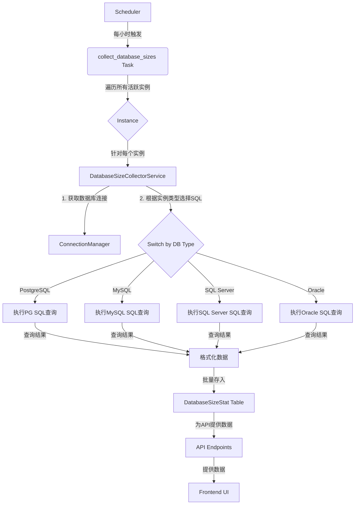
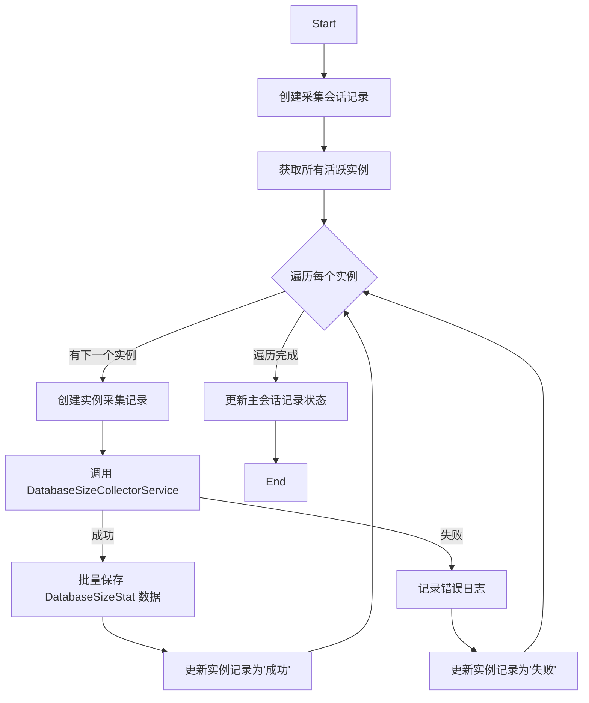

# 功能技术规格：数据库大小监控与分析

## 1. 功能概述

本功能旨在为 TaifishingV4 平台提供一个全面的数据库大小监控与分析解决方案。通过定期采集、存储和分析各数据库实例下每个具体数据库的大小信息（包括数据文件和日志文件），帮助用户有效管理存储资源、预测增长趋势、优化数据库性能，并为容量规划提供数据支持。

## 2. 架构整合设计

我们将采用一个与现有 `sync_accounts` 任务类似的异步任务处理模式，以确保数据采集过程的高效、可靠和非阻塞。



- **任务调度 (Scheduler)**: 复用现有的 `apscheduler`，添加一个新的定时任务 `collect_database_sizes`。
- **后台任务 (Task)**: 在 `app/tasks.py` 中创建 `collect_database_sizes` 任务，负责编排整个采集流程。
- **核心服务 (Service)**: 在 `app/services` 中创建 `DatabaseSizeCollectorService`，封装所有与数据库大小采集相关的业务逻辑。
- **数据模型 (Model)**: 在 `app/models` 中创建新的 `DatabaseSizeStat` 模型，用于持久化存储采集到的数据。
- **API层**: 在 `app/controllers` 中添加新的路由，提供数据查询接口。
- **前端 (UI)**: 在前端项目中修改相关页面，调用API并以图表和表格形式展示数据。

## 3. 数据模型设计

### 3.1. `DatabaseSizeStat` 模型

我们将创建一个新的 SQLAlchemy 模型 `DatabaseSizeStat` 来存储每个数据库在特定时间点的大小信息。

```python
# app/models/database_size_stat.py

from sqlalchemy import (
    Column,
    Integer,
    String,
    DateTime,
    ForeignKey,
    BigInteger,
    Index,
)
from sqlalchemy.orm import relationship
from app.models.base import Base
import datetime


class DatabaseSizeStat(Base):
    """
    存储每个数据库在特定时间点的大小统计信息。
    """

    __tablename__ = "database_size_stats"

    id = Column(Integer, primary_key=True, index=True)
    instance_id = Column(Integer, ForeignKey("instances.id"), nullable=False)
    database_name = Column(String(255), nullable=False, comment="数据库名称")
    size_mb = Column(BigInteger, nullable=False, comment="数据库总大小（MB）")
    data_size_mb = Column(
        BigInteger, nullable=True, comment="数据部分大小（MB），如果可获取"
    )
    log_size_mb = Column(
        BigInteger, nullable=True, comment="日志部分大小（MB），如果可获取"
    )
    collected_at = Column(
        DateTime, nullable=False, default=datetime.datetime.utcnow, comment="采集时间戳"
    )

    instance = relationship("Instance", back_populates="database_size_stats")

    __table_args__ = (
        Index(
            "ix_database_size_stats_instance_id_collected_at",
            "instance_id",
            "collected_at",
        ),
        Index(
            "ix_database_size_stats_instance_id_database_name_collected_at",
            "instance_id",
            "database_name",
            "collected_at",
            unique=True,
        ),
    )

    def __repr__(self):
        return f"<DatabaseSizeStat(id={self.id}, instance_id={self.instance_id}, db='{self.database_name}', size_mb={self.size_mb})>"

```

### 3.2. 扩展 `Instance` 模型

在 `app/models/instance.py` 的 `Instance` 模型中添加反向关系。

```python
# app/models/instance.py
# ... other imports
from sqlalchemy.orm import relationship

class Instance(Base):
    # ... existing columns
    database_size_stats = relationship(
        "DatabaseSizeStat",
        back_populates="instance",
        cascade="all, delete-orphan",
    )
    # ... rest of the class
```

## 4. 业务逻辑层设计 (`DatabaseSizeCollectorService`)

该服务将是数据采集的核心，负责处理不同数据库类型的查询逻辑。

### 4.1. 服务结构

```python
# app/services/database_size_collector_service.py

from app.models import Instance
from app.services.connections import ConnectionManager # 假设的连接管理器

class DatabaseSizeCollectorService:
    def __init__(self, instance: Instance):
        self.instance = instance
        self.connection = ConnectionManager.get_connection(instance.id) # 获取连接

    def collect(self) -> list[dict]:
        """
        根据实例类型，分派到相应的采集方法。
        """
        db_type = self.instance.db_type
        if db_type == "postgresql":
            return self._collect_postgresql()
        elif db_type == "mysql":
            return self._collect_mysql()
        elif db_type == "sqlserver":
            return self._collect_sqlserver()
        elif db_type == "oracle":
            return self._collect_oracle()
        else:
            # 对于不支持的数据库类型，记录日志并返回空
            print(f"Unsupported database type for size collection: {db_type}")
            return []

    def _execute_query(self, query: str) -> list:
        """
        执行SQL查询并返回结果。
        """
        # ... 使用 self.connection 执行查询的逻辑 ...
        pass

    # ... private methods for each db type ...
```

### 4.2. 具体数据库采集方案

#### 4.2.1. PostgreSQL

- **SQL查询**:
  ```sql
  SELECT
    datname AS database_name,
    pg_database_size(datname) / 1024 / 1024 AS size_mb
  FROM
    pg_database
  WHERE
    datistemplate = false;
  ```
- **权限要求**: 用户需要有连接到 `postgres` 数据库的权限，并且能够执行 `pg_database_size()` 函数。通常，标准用户即可。

#### 4.2.2. MySQL

- **SQL查询**:
  ```sql
  SELECT
    table_schema AS database_name,
    SUM(data_length + index_length) / 1024 / 1024 AS size_mb
  FROM
    information_schema.TABLES
  GROUP BY
    table_schema;
  ```
- **权限要求**: 用户需要对 `information_schema` 有 `SELECT` 权限，这是默认授予大多数用户的。

#### 4.2.3. SQL Server

- **SQL查询**:
  ```sql
  SELECT
      d.name AS database_name,
      (SUM(mf.size) * 8 / 1024) AS size_mb,
      SUM(CASE WHEN mf.type = 0 THEN mf.size * 8 / 1024 ELSE 0 END) AS data_size_mb,
      SUM(CASE WHEN mf.type = 1 THEN mf.size * 8 / 1024 ELSE 0 END) AS log_size_mb
  FROM
      sys.databases d
  JOIN
      sys.master_files mf ON d.database_id = mf.database_id
  GROUP BY
      d.name;
  ```
- **权限要求**: 用户需要 `VIEW ANY DEFINITION` 和 `VIEW SERVER STATE` 权限，或者成为 `sysadmin` 角色的成员。

#### 4.2.4. Oracle

- **SQL查询**:
  ```sql
  -- 查询总大小
  SELECT
      df.tablespace_name,
      SUM(df.bytes) / 1024 / 1024 AS data_size_mb
  FROM
      dba_data_files df
  GROUP BY
      df.tablespace_name;

  -- 查询日志大小
  SELECT
      SUM(bytes) / 1024 / 1024 AS log_size_mb
  FROM
      v$log;
  ```
  *注：Oracle的 "数据库" 概念与其它不同，通常采集 Tablespace 大小作为数据大小，并单独查询 Redo Log 大小。这里为了统一模型，可以将主要数据文件大小的总和作为 `data_size_mb`，重做日志文件大小作为 `log_size_mb`。*
- **权限要求**: 用户需要有对 `dba_data_files` 和 `v$log` 视图的 `SELECT` 权限。通常需要 `DBA` 或 `SELECT_CATALOG_ROLE` 角色。

## 5. 任务调度层设计

### 5.1. `collect_database_sizes` 任务

此任务将模仿 `sync_accounts` 的结构，实现健壮的错误处理和会话管理。



### 5.2. 调度器配置

在 `app/scheduler.py` 中添加新任务的调度配置。

```python
# app/scheduler.py

def init_scheduler(app):
    # ...
    scheduler.add_job(
        id="collect_database_sizes",
        func="app.tasks:collect_database_sizes",
        trigger="cron",
        hour=app.config.get("COLLECT_DB_SIZE_HOUR", "3"), # 每天凌晨3点执行
        minute="0",
        replace_existing=True,
    )
    # ...
```

## 6. API 接口设计

### 6.1. 获取指定实例的数据库大小历史

- **Endpoint**: `GET /api/v1/instances/<int:instance_id>/database-sizes`
- **权限**: 需要是实例的所有者或管理员。
- **查询参数**:
    - `start_date` (string, optional): YYYY-MM-DD
    - `end_date` (string, optional): YYYY-MM-DD
    - `database_name` (string, optional): 筛选特定数据库。
- **成功响应 (200 OK)**:
  ```json
  {
    "data": [
      {
        "database_name": "sales_db",
        "stats": [
          {"collected_at": "2023-10-26T10:00:00Z", "size_mb": 1024},
          {"collected_at": "2023-10-27T10:00:00Z", "size_mb": 1050}
        ]
      },
      {
        "database_name": "marketing_db",
        "stats": [
          {"collected_at": "2023-10-26T10:00:00Z", "size_mb": 512},
          {"collected_at": "2023-10-27T10:00:00Z", "size_mb": 520}
        ]
      }
    ]
  }
  ```

## 7. 前端用户界面设计

- **实例列表页**: 在实例卡片上增加一个“总数据库大小”的显示项，展示最近一次采集的所有数据库大小之和。
- **实例详情页**:
    - 新增一个 "存储" (Storage) 标签页。
    - 在该标签页内，默认显示一个面积图或堆叠条形图，展示总数据库大小在过去30天的增长趋势。
    - 图表下方提供一个表格，列出该实例下的所有数据库、它们最近一次采集的大小、数据大小、日志大小。
    - 提供日期范围选择器和数据库名称过滤器，让用户可以交互式地探索历史数据。

## 8. 安全与性能考量

- **连接安全**: 严格复用现有的加密连接和凭证管理机制。
- **查询性能**: 采集查询都针对系统视图和元数据表，对生产数据库的性能影响极小。查询应设置合理的超时时间。
- **数据量**: `DatabaseSizeStat` 表会随时间增长。需要考虑未来的数据归档或聚合策略。例如，只保留最近一年的日度数据，更早的数据聚合成月度平均值。
- **并发控制**: 采集任务应设计为单实例运行，避免并发冲突。

## 9. 实施计划

1.  **阶段一: 后端基础建设 (Sprint 1)**
    - [ ] 创建并迁移 `DatabaseSizeStat` 模型。
    - [ ] 在 `Instance` 模型中添加关系。
    - [ ] 实现 `DatabaseSizeCollectorService` 的基本结构和 PostgreSQL 的采集逻辑。
    - [ ] 创建 `collect_database_sizes` 后台任务的基础框架。

2.  **阶段二: 完善采集与调度 (Sprint 2)**
    - [ ] 在 `DatabaseSizeCollectorService` 中实现 MySQL, SQL Server, Oracle 的采集逻辑。
    - [ ] 完善 `collect_database_sizes` 任务的错误处理和状态记录逻辑。
    - [ ] 在调度器中正式添加并启用任务。

3.  **阶段三: API 与前端集成 (Sprint 3)**
    - [ ] 开发 `/api/v1/instances/<int:instance_id>/database-sizes` API 端点。
    - [ ] 在前端实例详情页添加 "存储" 标签页和历史趋势图。
    - [ ] 在前端实例列表页添加总大小显示。

## 10. 验收标准

- [ ] 所有活跃的、支持的数据库实例都能被定时任务覆盖。
- [ ] 采集到的数据（数据库名、大小、时间戳）准确无误地存储在 `DatabaseSizeStat` 表中。
- [ ] API 能够根据请求参数正确返回格式化的历史数据。
- [ ] 前端页面能够正确渲染数据库大小的历史趋势图和数据表格。
- [ ] 采集任务失败时，系统能够正确记录错误并继续处理下一个实例，不影响整体任务。