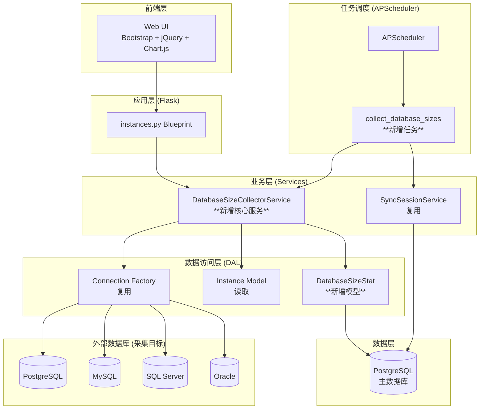
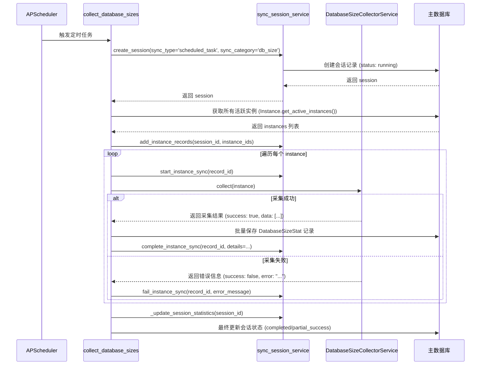

# 功能技术规格文档：数据库大小监控与分析

## 1. 文档信息

- **功能名称**: 数据库大小监控与分析 (Database Size Monitoring and Analysis)
- **文档版本**: v1.0
- **创建日期**: 2024-07-30
- **维护者**: 鲸落开发团队
- **关联文档**: [技术规格文档 (spec.md)](/Users/apple/Taifish/TaifishingV4/docs/architecture/spec.md)

## 2. 功能概述

本项目旨在为“鲸落”平台增加一个全面的、精细化的数据库大小监控与分析功能。该功能将允许用户跟踪其管理的各个数据库实例中，**每一个具体数据库（或Schema）** 的大小变化趋势，并区分**数据文件**和**日志文件**的大小。

系统将通过后台定时任务自动采集数据，模仿并复用现有的账户同步流程架构，利用平台统一的连接管理和会话跟踪机制。最终，通过一个功能丰富的交互式图表在前端进行多维度的数据展示和分析。

## 3. 架构整合设计

本功能将作为一项新的监控服务无缝集成到现有“鲸落”架构中，严格遵循分层设计原则。

### 整体架构集成图



## 4. 数据模型设计 (Data Model)

为了持久化存储每个数据库的历史大小数据，我们将创建一个新的 SQLAlchemy 模型。

### 4.1. 新建模型 `DatabaseSizeStat`

- **文件路径**: `app/models/database_size_stat.py`
- **模型说明**: 该模型用于存储单次采集中，特定实例下某个具体数据库的大小快照。

```python
from __future__ import annotations

from datetime import datetime
from typing import TYPE_CHECKING

from sqlalchemy import DateTime, ForeignKey, Integer, Numeric, String
from sqlalchemy.orm import Mapped, mapped_column, relationship

from app import db
from app.utils.time_utils import time_utils

if TYPE_CHECKING:
    from .instance import Instance

class DatabaseSizeStat(db.Model):
    """
    存储数据库大小历史数据的模型

    Attributes:
        id (int): 主键ID。
        instance_id (int): 关联的实例ID。
        database_name (str): 数据库的名称。
        data_size_mb (Numeric): 数据文件大小（MB）。
        log_size_mb (Numeric): 日志文件大小（MB）。
        total_size_mb (Numeric): 总大小（MB）。
        collected_at (datetime): 采集时间戳。
        instance (Instance): 关联的Instance对象。
    """
    __tablename__ = "database_size_stats"

    id: Mapped[int] = mapped_column(Integer, primary_key=True)
    instance_id: Mapped[int] = mapped_column(Integer, ForeignKey("instances.id"), nullable=False, index=True)
    database_name: Mapped[str] = mapped_column(String(255), nullable=False)
    data_size_mb: Mapped[float] = mapped_column(Numeric(15, 4), nullable=False, default=0.0)
    log_size_mb: Mapped[float] = mapped_column(Numeric(15, 4), nullable=False, default=0.0)
    total_size_mb: Mapped[float] = mapped_column(Numeric(15, 4), nullable=False, default=0.0)
    collected_at: Mapped[datetime] = mapped_column(DateTime, nullable=False, default=time_utils.now, index=True)

    instance: Mapped["Instance"] = relationship("Instance", back_populates="size_stats")

    __table_args__ = (
        db.Index("ix_database_size_stats_instance_id_db_name_collected_at", "instance_id", "database_name", "collected_at"),
    )

    def __repr__(self) -> str:
        return f"<DatabaseSizeStat(id={self.id}, instance='{self.instance.name}', db='{self.database_name}', size={self.total_size_mb}MB)>"

```

### 4.2. `Instance` 模型扩展

在 `app/models/instance.py` 中的 `Instance` 模型里，需要添加反向关联。

```python
# In app/models/instance.py, inside the Instance class

size_stats: Mapped[list["DatabaseSizeStat"]] = relationship(
    "DatabaseSizeStat", back_populates="instance", cascade="all, delete-orphan"
)
```

### 4.3. 数据库迁移

创建新模型文件后，需要执行 `flask db migrate -m "Add DatabaseSizeStat model"` 和 `flask db upgrade` 来应用变更。

## 5. 业务逻辑层设计 (Services)

### 5.1. `DatabaseSizeCollectorService`

这是本功能的核心服务，负责连接到目标数据库并执行采集。

- **文件路径**: `app/services/database_size_collector_service.py`
- **核心方法**: `collect(instance: Instance) -> dict`

#### 采集逻辑与SQL查询方案

`collect` 方法将通过 `instance.db_type` 来动态分派到对应的私有方法（`_collect_postgresql`, `_collect_mysql` 等）。服务将复用 `db_context.py` 中的连接管理能力。

---

#### **PostgreSQL**

- **采集方法**: `_collect_postgresql`
- **SQL查询**:
  ```sql
  SELECT
      datname AS database_name,
      pg_database_size(datname) / 1024.0 / 1024.0 AS total_size_mb
  FROM
      pg_database
  WHERE
      datistemplate = false;
  ```
- **说明**:
  - `pg_database_size()` 函数直接计算指定数据库的总大小（数据+索引等）。
  - PostgreSQL 的事务日志（WAL）是实例级别的，无法通过标准SQL轻易地归属到单个数据库。因此，我们将 `data_size_mb` 记为总大小，`log_size_mb` 记为 `0`。
- **权限要求**: 能够连接到实例并执行 `pg_database_size()` 函数即可，普通用户权限通常就足够。

---

#### **MySQL**

- **采集方法**: `_collect_mysql`
- **SQL查询**:
  ```sql
  SELECT
      table_schema AS database_name,
      SUM(data_length + index_length) / 1024.0 / 1024.0 AS data_size_mb
  FROM
      information_schema.TABLES
  GROUP BY
      table_schema;
  ```
- **说明**:
  - 此查询聚合了 `information_schema.TABLES` 中每个 schema（在MySQL中等同于database）的数据和索引大小。
  - MySQL 的 Redo/Undo 日志是实例共享的，无法归属到单个数据库。因此，`log_size_mb` 记为 `0`。
- **权限要求**: 对 `information_schema` 的只读权限，这是默认授予几乎所有用户的。

---

#### **SQL Server**

- **采集方法**: `_collect_sql_server`
- **SQL查询**:
  ```sql
  SELECT
      DB_NAME(database_id) AS database_name,
      SUM(CASE WHEN type_desc = 'ROWS' THEN size * 8.0 / 1024.0 ELSE 0 END) AS data_size_mb,
      SUM(CASE WHEN type_desc = 'LOG' THEN size * 8.0 / 1024.0 ELSE 0 END) AS log_size_mb
  FROM
      sys.master_files
  GROUP BY
      database_id;
  ```
- **说明**:
  - `sys.master_files` 视图包含了实例上所有数据库的数据文件（ROWS）和日志文件（LOG）的详细信息。
  - `size` 列的单位是 8KB 页，因此需要乘以 8 再除以 1024 得到 MB。
  - 这是最理想的情况，可以精确分离数据和日志大小。
- **权限要求**: 需要 `VIEW ANY DEFINITION` 或 `VIEW SERVER STATE` 权限，或者 `sysadmin` 固定服务器角色的成员。

---

#### **Oracle**

- **采集方法**: `_collect_oracle`
- **SQL查询**:
  - **查询所有用户/Schemas**: `SELECT username FROM dba_users;`
  - **查询数据大小 (按Schema)**:
    ```sql
    SELECT
        owner AS database_name,
        SUM(bytes) / 1024.0 / 1024.0 AS data_size_mb
    FROM
        dba_segments
    GROUP BY
        owner;
    ```
  - **查询日志大小 (实例级别)**:
    ```sql
    -- Online Redo Logs
    SELECT SUM(bytes) / 1024.0 / 1024.0 FROM v$log;
    -- Archived Logs (if applicable, more complex)
    ```
- **说明**:
  - 在Oracle中，大小通常按 `owner` (Schema) 来统计。我们将把每个 Schema 视为一个独立的“数据库”进行采集。
  - Redo 日志是实例级别的，无法归属到单个 Schema。因此，我们会将查询到的实例级日志总大小**按比例**分配给每个 Schema（基于其数据大小占比），或者简单地将日志大小记录在 `default_tablespace` 对应的用户下。为简化起见，初期方案建议**仅记录数据大小**，`log_size_mb` 记为 `0`。
- **权限要求**: 需要对 `dba_segments` 和 `dba_users` 的 `SELECT` 权限。这通常意味着需要一个具有 `DBA` 角色或被授予了 `SELECT ANY DICTIONARY` 权限的专用监控用户。**这是本功能对Oracle最强的依赖和限制**。

## 6. 任务调度层设计 (Task Scheduling)

我们将创建一个新的后台任务，其结构和流程将严格模仿 `sync_accounts`。

### 6.1. 新建任务 `collect_database_sizes`

- **文件路径**: `app/tasks.py`
- **任务流程**:



### 6.2. 调度器配置

- **文件路径**: `config/scheduler_tasks.yaml`
- **新增配置**:

```yaml
  - id: "collect_database_sizes"
    name: "数据库大小采集"
    function: "app.tasks.collect_database_sizes"
    trigger_type: "cron"
    trigger_params:
      hour: 3
      minute: 0
    enabled: true
    description: "每日凌晨3点执行，采集所有活跃实例的数据库大小。"
```

## 7. API 接口设计

API 将遵循项目现有的 RESTful 规范。

### `GET /api/instances/<int:instance_id>/database-sizes`

- **功能**: 获取指定实例下所有数据库的大小历史记录。
- **认证**: 需要登录。
- **参数**:
  - `start_date` (string, optional, format: `YYYY-MM-DD`): 查询周期的开始日期。
  - `end_date` (string, optional, format: `YYYY-MM-DD`): 查询周期的结束日期。
- **成功响应 (200 OK)**:
  ```json
  {
      "success": true,
      "data": {
          "instance_name": "My PostgreSQL Prod",
          "results": [
              {
                  "database_name": "sales_db",
                  "history": [
                      {"collected_at": "2024-07-29T03:00:00Z", "total_size_mb": 1024.50},
                      {"collected_at": "2024-07-30T03:00:00Z", "total_size_mb": 1030.00}
                  ]
              },
              {
                  "database_name": "marketing_db",
                  "history": [
                      {"collected_at": "2024-07-29T03:00:00Z", "total_size_mb": 512.00},
                      {"collected_at": "2024-07-30T03:00:00Z", "total_size_mb": 515.75}
                  ]
              }
          ]
      }
  }
  ```

### `POST /api/instances/<int:instance_id>/database-sizes/collect`

- **功能**: 手动触发对指定实例的数据库大小采集任务。
- **认证**: 需要登录，且建议限制为管理员角色。
- **成功响应 (202 Accepted)**:
  ```json
  {
      "success": true,
      "message": "数据库大小采集任务已启动。",
      "data": {
          "session_id": "uuid-string-of-the-new-session"
      }
  }
  ```

## 8. 前端用户界面 (UI/UX)

- **位置**: 在实例详情页面 (`/instances/<id>`) 新增一个名为 “**存储分析 (Storage Analysis)**” 的 Tab。
- **核心组件**: 使用 `Chart.js` 库实现一个交互式图表。
- **交互功能**:
    1.  **图表区域**: 默认显示该实例下**所有数据库大小总和**的折线图。
    2.  **数据库筛选器 (多选下拉框)**:
        - 位于图表上方。
        - 列出该实例下所有被采集到的 `database_name`。
        - 用户可以选择一个或多个数据库，图表会动态更新，为每个选中的数据库渲染一条独立的线。
        - 提供“全选/全不选”功能。
    3.  **Top N 筛选**:
        - 一组按钮，如 `Top 5`, `Top 10`。
        - 点击后，筛选器将自动勾选当前大小排名前 N 的数据库。
    4.  **时间范围选择器**:
        - 预设按钮：`最近7天`, `最近30天`, `最近90天`。
        - 自定义日期范围选择器。
- **数据展示**:
    - **Tooltip**: 鼠标悬浮在图表上时，显示时间点、数据库名称、数据大小、日志大小和总大小。
    - **图例 (Legend)**: 清晰地标示每条线对应的数据库名称。

## 9. 安全与性能

- **安全**:
  - 采集任务使用的数据库凭证继承自 `Instance` 配置，遵循现有安全策略。
  - 明确告知用户在 Oracle 等数据库上所需的 `SELECT` 权限，避免使用过度权限的账户。
- **性能**:
  - `DatabaseSizeStat` 表上的复合索引将确保历史数据查询的高效。
  - 采集查询本身对生产数据库的影响极小，因为它们通常是针对系统目录/视图的快速查询。
  - 后台任务与Web进程分离，不会影响用户体验。

## 10. 实施计划

1.  **Phase 1: 后端基础建设**
    1.  创建 `app/models/database_size_stat.py` 文件并定义 `DatabaseSizeStat` 模型。
    2.  在 `app/models/instance.py` 中添加反向关系。
    3.  运行 `flask db migrate` 和 `flask db upgrade` 应用数据库变更。
    4.  创建 `app/services/database_size_collector_service.py` 文件，并实现 `DatabaseSizeCollectorService` 的基本框架和针对 **PostgreSQL** 的采集逻辑。
2.  **Phase 2: 任务与调度**
    1.  在 `app/tasks.py` 中创建 `collect_database_sizes` 任务，并集成 `sync_session_service` 和 `DatabaseSizeCollectorService`。
    2.  在 `config/scheduler_tasks.yaml` 中添加新任务的调度配置。
    3.  手动测试任务执行的完整流程。
3.  **Phase 3: 扩展采集能力**
    1.  在 `DatabaseSizeCollectorService` 中依次实现对 `MySQL`, `SQL Server`, `Oracle` 的采集逻辑。
4.  **Phase 4: API与前端**
    1.  在 `app/routes/instances.py` 中添加新的 API 端点。
    2.  修改前端模板，添加“存储分析” Tab。
    3.  编写 JavaScript 代码，使用 Chart.js 实现交互式图表和所有筛选功能。

## 11. 验收标准

- [ ] `database_size_stats` 表结构正确创建。
- [ ] 后台定时任务能够按时执行，并为所有活跃实例创建同步会话。
- [ ] 针对四种数据库类型的采集均能成功，并将数据正确存入新表。
- [ ] 手动触发采集的 API 能正常工作。
- [ ] 获取历史数据的 API 能根据参数返回正确格式的 JSON。
- [ ] 前端图表能正确渲染，并且所有筛选和交互功能均按预期工作。
- [ ] 任务失败时，能在同步会话中正确记录错误信息。