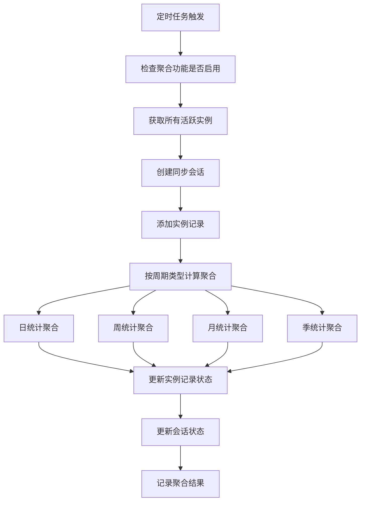
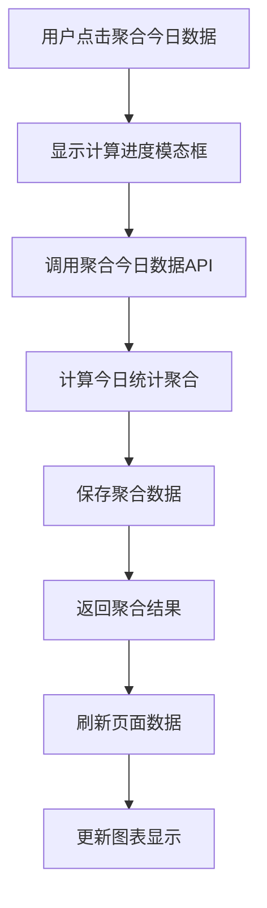

# 统计聚合功能技术文档

## 1. 功能概述

### 1.1 功能描述
统计聚合功能是鲸落系统的核心数据分析功能，用于对数据库大小数据进行多维度统计聚合分析。该功能支持日、周、月、季度等多种时间周期的聚合计算，提供趋势分析、容量监控和增长预测等高级功能。

### 1.2 主要特性
- **多周期聚合**：支持日、周、月、季度四种统计周期
- **智能计算**：自动计算平均值、最大值、最小值等统计指标
- **趋势分析**：提供容量增长趋势和变化率分析
- **会话管理**：集成到统一的同步会话管理系统
- **可视化展示**：提供丰富的图表和趋势分析界面
- **数据清理**：支持历史数据的自动清理和归档

### 1.3 技术特点
- 基于SQLAlchemy ORM的复杂查询优化
- 多维度数据聚合和统计分析
- 实时图表渲染和交互式可视化
- 增量计算和变化率分析
- 会话管理和进度跟踪

## 2. 技术架构

### 2.1 整体架构
```
┌─────────────────┐    ┌─────────────────┐    ┌─────────────────┐
│   前端界面      │    │   后端服务      │    │   数据库        │
│                 │    │                 │    │                 │
│ - 聚合页面      │◄──►│ - 聚合服务      │◄──►│ - database_size_aggregations│
│ - 图表展示      │    │ - 定时任务      │    │ - database_size_stats│
│ - 趋势分析      │    │ - 会话管理      │    │ - sync_sessions │
└─────────────────┘    └─────────────────┘    └─────────────────┘
```

### 2.2 模块关系
- **前端模块**：聚合页面、图表组件、趋势分析界面
- **后端模块**：聚合服务、定时任务、会话管理服务
- **数据模块**：聚合统计模型、容量统计模型、同步会话模型

## 3. 前端实现

### 3.1 页面结构
- **主页面**：`app/templates/database_sizes/aggregations.html`
- **样式文件**：`app/static/css/pages/database_sizes/aggregations.css`
- **脚本文件**：`app/static/js/pages/database_sizes/aggregations.js`

### 3.2 核心组件

#### 3.2.1 统计概览卡片组件
```html
<!-- 统计概览 -->
<div class="row mb-4">
    <div class="col-md-3">
        <div class="card bg-primary text-white">
            <div class="card-body">
                <div class="d-flex justify-content-between">
                    <div>
                        <h6 class="card-title">总实例数</h6>
                        <h3 class="mb-0" id="totalInstances">-</h3>
                    </div>
                    <div class="align-self-center">
                        <i class="fas fa-server fa-2x opacity-75"></i>
                    </div>
                </div>
            </div>
        </div>
    </div>
    <!-- 其他统计卡片... -->
</div>
```

#### 3.2.2 聚合趋势图表组件
```html
<!-- 图表区域 -->
<div class="row mb-4">
    <div class="col-12">
        <div class="card">
            <div class="card-header">
                <div class="row align-items-center">
                    <div class="col-md-6">
                        <h5 class="card-title mb-0">
                            <i class="fas fa-chart-area me-2"></i>
                            聚合趋势图
                        </h5>
                    </div>
                    <div class="col-md-6">
                        <div class="d-flex gap-2">
                            <div class="btn-group" role="group">
                                <input type="radio" class="btn-check" name="chartMode" id="chartModeDatabase" value="database" checked>
                                <label class="btn btn-outline-success" for="chartModeDatabase">数据库</label>
                                
                                <input type="radio" class="btn-check" name="chartMode" id="chartModeInstance" value="instance">
                                <label class="btn btn-outline-success" for="chartModeInstance">实例</label>
                            </div>
                            
                            <div class="btn-group" role="group">
                                <input type="radio" class="btn-check" name="chartType" id="chartTypeLine" value="line" checked>
                                <label class="btn btn-outline-primary" for="chartTypeLine">折线图</label>
                                
                                <input type="radio" class="btn-check" name="chartType" id="chartTypeBar" value="bar">
                                <label class="btn btn-outline-primary" for="chartTypeBar">柱状图</label>
                            </div>
                        </div>
                    </div>
                </div>
            </div>
            <div class="card-body">
                <div class="position-relative">
                    <div id="aggregationChart" style="height: 500px; width: 100%;"></div>
                    <div id="chartLoading" class="position-absolute top-50 start-50 translate-middle d-none">
                        <div class="spinner-border text-primary" role="status">
                            <span class="visually-hidden">加载中...</span>
                        </div>
                    </div>
                </div>
            </div>
        </div>
    </div>
</div>
```

### 3.3 关键JavaScript函数

#### 3.3.1 聚合管理器类
```javascript
class AggregationsManager {
    constructor() {
        this.chart = null;
        this.detailChart = null;
        this.isRenderingChart = false;
        this.currentData = [];
        this.currentSummary = null;
        this.currentFilters = {
            instance: '',
            dbType: '',
            periodType: 'daily',
            database: '',
            dateRange: 7
        };
        this.currentSortBy = 'period_start';
        this.currentChartType = 'line';
        this.currentChartMode = 'database';
        
        this.init();
    }
    
    /**
     * 初始化页面
     */
    init() {
        this.bindEvents();
        this.initializeDatabaseFilter();
        this.loadSummaryData();
        this.loadChartData();
    }
}
```

#### 3.3.2 图表渲染函数
```javascript
/**
 * 渲染图表
 */
renderChart(data) {
    const chartContainer = document.getElementById('aggregationChart');
    if (!chartContainer) {
        console.error('图表容器 #aggregationChart 不存在！');
        return;
    }

    if (this.isRenderingChart) {
        console.warn('图表正在渲染中，跳过本次渲染请求');
        return;
    }
    this.isRenderingChart = true;

    try {
        // 销毁现有图表
        if (this.chart) {
            this.chart.destroy();
            this.chart = null;
        }

        // 清空容器
        chartContainer.innerHTML = '';
        
        // 创建新的canvas元素
        const canvas = document.createElement('canvas');
        canvas.id = 'aggregationChartCanvas';
        canvas.style.width = '100%';
        canvas.style.height = '100%';
        chartContainer.appendChild(canvas);

        const ctx = canvas.getContext('2d');
        if (!ctx) {
            console.error('无法获取canvas上下文');
            return;
        }

        // 处理数据
        let labels, datasets;
        
        if (!data || data.length === 0) {
            // 空数据情况
            labels = ['暂无数据'];
            datasets = [{
                label: '无数据',
                data: [0],
                backgroundColor: 'rgba(200, 200, 200, 0.2)',
                borderColor: 'rgba(200, 200, 200, 0.8)',
                borderWidth: 1
            }];
        } else {
            // 有数据情况
            const groupedData = this.groupDataByDate(data);
            labels = Object.keys(groupedData).sort();
            datasets = this.prepareChartDatasets(groupedData, labels);
        }

        // 根据数据情况调整图表类型
        let chartType = this.currentChartType;
        if (labels.length === 1 && labels[0] !== '暂无数据') {
            if (chartType === 'line') {
                chartType = 'bar';
            }
        }

        const chartConfig = {
            type: chartType,
            data: { labels, datasets },
            options: {
                responsive: true,
                maintainAspectRatio: false,
                layout: { padding: { right: 120 } },
                interaction: { intersect: false, mode: 'index' },
                plugins: {
                    title: {
                        display: true,
                        text: this.getChartTitle(labels.length, data?.length || 0),
                        font: { size: 16, weight: 'bold' }
                    },
                    legend: {
                        display: labels.length > 1 || (labels.length === 1 && labels[0] !== '暂无数据'),
                        position: 'right',
                        align: 'start',
                        maxHeight: 500,
                        labels: {
                            usePointStyle: true,
                            padding: 4,
                            boxWidth: 8,
                            boxHeight: 8,
                            font: { size: 10 }
                        }
                    },
                    tooltip: {
                        mode: 'index',
                        intersect: false,
                        callbacks: {
                            label: function(context) {
                                const label = context.dataset.label || '';
                                const value = context.parsed.y;
                                return `${label}: ${AggregationsManager.prototype.formatSizeFromMB(value)}`;
                            }
                        }
                    }
                },
                scales: {
                    x: { 
                        display: true, 
                        title: { display: true, text: this.getXAxisTitle(labels.length) }, 
                        grid: { display: false } 
                    },
                    y: {
                        display: true,
                        title: { display: true, text: '存储大小' },
                        beginAtZero: true,
                        grid: { color: 'rgba(0, 0, 0, 0.1)' },
                        ticks: { callback: (v) => AggregationsManager.prototype.formatSizeFromMB(v) }
                    }
                }
            }
        };

        this.chart = new Chart(ctx, chartConfig);
        
    } catch (err) {
        console.error('渲染图表时出错:', err);
        this.showError('渲染图表时出错: ' + (err && err.message ? err.message : ''));
    } finally {
        this.isRenderingChart = false;
    }
}
```

#### 3.3.3 数据分组和准备函数
```javascript
/**
 * 按日期分组数据
 */
groupDataByDate(data) {
    const grouped = {};
    
    data.forEach(item => {
        const date = item.period_start;
        if (!date) {
            console.warn('数据项缺少period_start:', item);
            return;
        }
        
        if (!grouped[date]) {
            grouped[date] = {};
        }
        
        if (this.currentChartMode === 'instance') {
            // 按实例分组，累加所有数据库的大小
            const instanceName = item.instance?.name || '未知实例';
            if (!grouped[date][instanceName]) {
                grouped[date][instanceName] = 0;
            }
            grouped[date][instanceName] += item.avg_size_mb || 0;
        } else {
            // 按数据库分组，使用avg_size_mb作为显示值
            const dbName = item.database_name || '未知数据库';
            if (!grouped[date][dbName]) {
                grouped[date][dbName] = 0;
            }
            grouped[date][dbName] += item.avg_size_mb || 0;
        }
    });
    
    return grouped;
}

/**
 * 准备图表数据集
 */
prepareChartDatasets(groupedData, labels) {
    if (this.currentChartMode === 'instance') {
        return this.prepareInstanceDatasets(groupedData, labels);
    } else {
        return this.prepareDatabaseDatasets(groupedData, labels);
    }
}

/**
 * 准备数据库数据集
 */
prepareDatabaseDatasets(groupedData, labels) {
    const topDatabases = [...new Set(this.currentData.map(item => item.database_name).filter(Boolean))];
    
    if (topDatabases.length === 0) {
        return [];
    }
    
    const colors = [
        '#667eea', '#764ba2', '#f093fb', '#f5576c',
        '#4facfe', '#00f2fe', '#43e97b', '#38f9d7',
        '#fa709a', '#fee140', '#a8edea', '#fed6e3',
        '#ff9a9e', '#fecfef', '#fecfef', '#a8c0ff',
        '#ffecd2', '#fcb69f', '#ff8a80', '#ff80ab'
    ];
    
    return topDatabases.map((db, index) => ({
        label: db,
        data: labels.map(date => groupedData[date]?.[db] || 0),
        borderColor: colors[index % colors.length],
        backgroundColor: colors[index % colors.length] + '20',
        tension: 0.1
    }));
}
```

### 3.4 样式设计

#### 3.4.1 聚合页面样式
```css
/* 统计聚合页面特定样式 */
.aggregations-page .search-filter-card {
    margin-bottom: 1rem;
}

.aggregations-page .card-body {
    padding: 0.75rem 1rem;
}

.aggregations-page .unified-search-form .row {
    margin-bottom: 0;
}

.aggregations-page .filter-instance,
.aggregations-page .filter-period-type,
.aggregations-page .filter-database,
.aggregations-page .filter-db-type,
.aggregations-page .filter-time-range {
    margin-bottom: 0.25rem;
}

/* 优化搜索框高度 */
.aggregations-page .unified-search-form .form-label {
    margin-bottom: 0.25rem;
    font-size: 0.85rem;
}

.aggregations-page .unified-search-form .unified-input,
.aggregations-page .unified-search-form .unified-select {
    padding: 0.5rem 0.75rem;
    font-size: 0.9rem;
}

.aggregations-page .unified-search-form .btn {
    padding: 0.5rem 1rem;
    font-size: 0.9rem;
}
```

## 4. 后端实现

### 4.1 路由控制器
**文件**：`app/routes/database_sizes.py`

#### 4.1.1 聚合页面API
```python
@database_sizes_bp.route('/aggregations', methods=['GET'])
@login_required
@view_required
def aggregations():
    """
    统计聚合页面或API
    
    如果是页面请求（无查询参数），返回HTML页面
    如果是API请求（有查询参数），返回JSON数据
    """
    # 检查是否有查询参数，如果有则返回API数据
    if request.args:
        try:
            # 获取查询参数
            instance_id = request.args.get('instance_id', type=int)
            db_type = request.args.get('db_type')
            database_name = request.args.get('database_name')
            period_type = request.args.get('period_type')
            start_date = request.args.get('start_date')
            end_date = request.args.get('end_date')
            
            # 分页参数
            page = request.args.get('page', 1, type=int)
            per_page = request.args.get('per_page', 20, type=int)
            get_all = request.args.get('get_all', 'false').lower() == 'true'
            
            # 构建查询
            query = DatabaseSizeAggregation.query.join(Instance)
            
            # 应用筛选条件
            if instance_id:
                query = query.filter(DatabaseSizeAggregation.instance_id == instance_id)
            if db_type:
                query = query.filter(Instance.db_type == db_type)
            if database_name:
                query = query.filter(DatabaseSizeAggregation.database_name == database_name)
            if period_type:
                query = query.filter(DatabaseSizeAggregation.period_type == period_type)
            if start_date:
                query = query.filter(DatabaseSizeAggregation.period_start >= start_date)
            if end_date:
                query = query.filter(DatabaseSizeAggregation.period_end <= end_date)
            
            # 排序
            query = query.order_by(desc(DatabaseSizeAggregation.period_start))
            
            if get_all:
                # 返回所有数据（用于图表）
                aggregations = query.limit(1000).all()
                data = [self._format_aggregation(agg) for agg in aggregations]
                
                return jsonify({
                    'success': True,
                    'data': data,
                    'total': len(data)
                })
            else:
                # 分页返回
                pagination = query.paginate(
                    page=page, per_page=per_page, error_out=False
                )
                
                data = [self._format_aggregation(agg) for agg in pagination.items]
                
                return jsonify({
                    'success': True,
                    'data': data,
                    'pagination': {
                        'page': pagination.page,
                        'pages': pagination.pages,
                        'per_page': pagination.per_page,
                        'total': pagination.total,
                        'has_next': pagination.has_next,
                        'has_prev': pagination.has_prev
                    }
                })
                
        except Exception as e:
            logger.error(f"获取聚合数据失败: {str(e)}")
            return jsonify({
                'success': False,
                'error': str(e)
            }), 500
    else:
        # 返回HTML页面
        return render_template('database_sizes/aggregations.html')
```

#### 4.1.2 聚合今日数据API
```python
@database_sizes_bp.route('/aggregate-today', methods=['POST'])
@login_required
@view_required
def aggregate_today():
    """
    聚合今日数据
    """
    try:
        from app.services.database_size_aggregation_service import DatabaseSizeAggregationService
        
        service = DatabaseSizeAggregationService()
        result = service.calculate_today_aggregations()
        
        if result['status'] == 'success':
            return jsonify({
                'success': True,
                'message': result['message'],
                'data': {
                    'aggregations_created': result.get('total_records', 0),
                    'processed_instances': result.get('processed_instances', 0)
                }
            })
        else:
            return jsonify({
                'success': False,
                'error': result.get('error', '聚合失败')
            }), 500
            
    except Exception as e:
        logger.error(f"聚合今日数据失败: {str(e)}")
        return jsonify({
            'success': False,
            'error': str(e)
        }), 500
```

### 4.2 服务层

#### 4.2.1 数据库大小聚合服务
**文件**：`app/services/database_size_aggregation_service.py`

```python
class DatabaseSizeAggregationService:
    """数据库大小统计聚合服务"""
    
    def __init__(self):
        self.period_types = ['daily', 'weekly', 'monthly', 'quarterly']
    
    def calculate_daily_aggregations(self) -> Dict[str, Any]:
        """
        计算每日统计聚合（定时任务用，处理昨天的数据）
        
        Returns:
            Dict[str, Any]: 聚合结果统计
        """
        logger.info("开始计算每日统计聚合...")
        
        # 获取昨天的数据（确保有完整的数据进行聚合）
        end_date = date.today() - timedelta(days=1)
        start_date = end_date  # 同一天，处理昨天的数据
        
        return self._calculate_aggregations('daily', start_date, end_date)
    
    def calculate_today_aggregations(self) -> Dict[str, Any]:
        """
        计算今日统计聚合（手动触发用，处理今天的数据）
        
        Returns:
            Dict[str, Any]: 聚合结果统计
        """
        logger.info("开始计算今日统计聚合...")
        
        # 获取今天的数据进行聚合
        end_date = date.today()
        start_date = end_date  # 同一天，处理今天的数据
        
        return self._calculate_aggregations('daily', start_date, end_date)
    
    def calculate_weekly_aggregations(self) -> Dict[str, Any]:
        """
        计算每周统计聚合
        
        Returns:
            Dict[str, Any]: 聚合结果统计
        """
        logger.info("开始计算每周统计聚合...")
        
        # 获取上周的数据
        end_date = date.today()
        start_date = end_date - timedelta(days=7)
        
        return self._calculate_aggregations('weekly', start_date, end_date)
    
    def calculate_monthly_aggregations(self) -> Dict[str, Any]:
        """
        计算每月统计聚合
        
        Returns:
            Dict[str, Any]: 聚合结果统计
        """
        logger.info("开始计算每月统计聚合...")
        
        # 获取上个月的数据
        today = date.today()
        if today.month == 1:
            start_date = date(today.year - 1, 12, 1)
            end_date = date(today.year - 1, 12, 31)
        else:
            start_date = date(today.year, today.month - 1, 1)
            end_date = date(today.year, today.month, 1) - timedelta(days=1)
        
        return self._calculate_aggregations('monthly', start_date, end_date)
    
    def calculate_quarterly_aggregations(self) -> Dict[str, Any]:
        """
        计算每季度统计聚合
        
        Returns:
            Dict[str, Any]: 聚合结果统计
        """
        logger.info("开始计算每季度统计聚合...")
        
        # 获取上个季度的数据
        today = date.today()
        quarter = (today.month - 1) // 3 + 1
        
        if quarter == 1:
            # 上个季度是去年Q4
            start_date = date(today.year - 1, 10, 1)
            end_date = date(today.year - 1, 12, 31)
        else:
            # 上个季度是今年Q(quarter-1)
            quarter_start_month = (quarter - 2) * 3 + 1
            start_date = date(today.year, quarter_start_month, 1)
            end_date = date(today.year, quarter_start_month + 2, 1) - timedelta(days=1)
        
        return self._calculate_aggregations('quarterly', start_date, end_date)
```

#### 4.2.2 聚合计算核心逻辑
```python
def _calculate_aggregations(self, period_type: str, start_date: date, end_date: date) -> Dict[str, Any]:
    """
    计算指定周期的统计聚合
    
    Args:
        period_type: 统计周期类型
        start_date: 开始日期
        end_date: 结束日期
        
    Returns:
        Dict[str, Any]: 聚合结果统计
    """
    try:
        # 获取所有活跃实例
        instances = Instance.query.filter_by(is_active=True).all()
        
        total_processed = 0
        total_errors = 0
        total_records = 0
        
        for instance in instances:
            try:
                # 获取该实例在指定时间范围内的数据
                stats = DatabaseSizeStat.query.filter(
                    DatabaseSizeStat.instance_id == instance.id,
                    DatabaseSizeStat.collected_date >= start_date,
                    DatabaseSizeStat.collected_date <= end_date
                ).all()
                
                if not stats:
                    logger.debug(f"实例 {instance.name} 在 {start_date} 到 {end_date} 期间没有数据")
                    continue
                
                # 按数据库分组计算统计
                db_groups = {}
                for stat in stats:
                    db_name = stat.database_name
                    if db_name not in db_groups:
                        db_groups[db_name] = []
                    db_groups[db_name].append(stat)
                
                # 为每个数据库计算统计聚合
                for db_name, db_stats in db_groups.items():
                    self._calculate_database_aggregation(
                        instance.id, db_name, period_type, 
                        start_date, end_date, db_stats
                    )
                    total_records += 1
                
                total_processed += 1
                logger.debug(f"实例 {instance.name} 的 {period_type} 聚合计算完成")
                
            except Exception as e:
                logger.error(f"处理实例 {instance.id} 的 {period_type} 统计聚合时出错: {str(e)}")
                total_errors += 1
                continue
        
        return {
            'status': 'success',
            'period_type': period_type,
            'start_date': start_date.isoformat(),
            'end_date': end_date.isoformat(),
            'total_instances': len(instances),
            'processed_instances': total_processed,
            'total_records': total_records,
            'errors': total_errors
        }
        
    except Exception as e:
        logger.error(f"计算 {period_type} 统计聚合时出错: {str(e)}")
        return {
            'status': 'error',
            'period_type': period_type,
            'error': str(e)
        }
```

### 4.3 定时任务

#### 4.3.1 统计聚合定时任务
**文件**：`app/tasks/database_size_aggregation_tasks.py`

```python
def calculate_database_size_aggregations():
    """
    计算数据库大小统计聚合
    每天凌晨4点执行，计算周、月、季度统计
    支持会话管理，可在会话中心查看进度
    """
    from app.services.sync_session_service import sync_session_service
    from app.utils.timezone import now
    from app.utils.structlog_config import get_sync_logger
    
    sync_logger = get_sync_logger()
    
    try:
        sync_logger.info("开始执行数据库大小统计聚合任务", module="aggregation_sync")
        
        # 检查聚合功能是否启用
        if not getattr(Config, 'AGGREGATION_ENABLED', True):
            sync_logger.info("数据库大小统计聚合功能已禁用", module="aggregation_sync")
            return {
                'success': True,
                'message': '统计聚合功能已禁用',
                'aggregations_created': 0
            }
        
        # 获取所有活跃的实例
        active_instances = Instance.query.filter_by(is_active=True).all()
        
        if not active_instances:
            sync_logger.warning("没有找到活跃的数据库实例", module="aggregation_sync")
            return {
                'success': True,
                'message': '没有活跃的数据库实例需要聚合',
                'aggregations_created': 0
            }
        
        # 创建同步会话
        session = sync_session_service.create_session(
            sync_type="scheduled_task",
            sync_category="aggregation",
            created_by=None  # 定时任务没有创建者
        )
        
        # 添加实例记录
        instance_ids = [inst.id for inst in active_instances]
        records = sync_session_service.add_instance_records(session.session_id, instance_ids)
        session.total_instances = len(active_instances)
        
        total_processed = 0
        total_failed = 0
        total_aggregations = 0
        results = []
        
        # 创建聚合服务
        service = DatabaseSizeAggregationService()
        
        # 按周期类型计算聚合
        period_types = ['daily', 'weekly', 'monthly', 'quarterly']
        
        for period_type in period_types:
            try:
                sync_logger.info(
                    f"开始计算 {period_type} 周期聚合",
                    module="aggregation_sync",
                    session_id=session.session_id,
                    period_type=period_type
                )
                
                # 计算该周期的聚合数据
                if period_type == 'daily':
                    period_result = service.calculate_daily_aggregations()
                elif period_type == 'weekly':
                    period_result = service.calculate_weekly_aggregations()
                elif period_type == 'monthly':
                    period_result = service.calculate_monthly_aggregations()
                elif period_type == 'quarterly':
                    period_result = service.calculate_quarterly_aggregations()
                else:
                    continue
                
                # 累计聚合结果
                if period_result.get('status') == 'success':
                    total_aggregations += period_result.get('total_records', 0)
                    sync_logger.info(
                        f"{period_type} 周期聚合完成",
                        module="aggregation_sync",
                        session_id=session.session_id,
                        period_type=period_type,
                        aggregations_created=period_result.get('total_records', 0)
                    )
                else:
                    sync_logger.error(
                        f"{period_type} 周期聚合失败",
                        module="aggregation_sync",
                        session_id=session.session_id,
                        period_type=period_type,
                        error=period_result.get('error', '未知错误')
                    )
                
                results.append({
                    'period_type': period_type,
                    'result': period_result
                })
                
            except Exception as e:
                sync_logger.error(
                    f"计算 {period_type} 周期聚合失败",
                    module="aggregation_sync",
                    session_id=session.session_id,
                    period_type=period_type,
                    error=str(e)
                )
                results.append({
                    'period_type': period_type,
                    'result': {'status': 'failed', 'error': str(e)}
                })
                continue
        
        # 根据聚合结果更新所有实例记录状态
        all_periods_success = all(
            result.get('result', {}).get('status') == 'success' 
            for result in results
        )
        
        for i, instance in enumerate(active_instances):
            record = records[i] if i < len(records) else None
            if record:
                try:
                    sync_session_service.start_instance_sync(record.id)
                    
                    if all_periods_success:
                        sync_session_service.complete_instance_sync(
                            record.id,
                            accounts_synced=1,  # 聚合任务使用1表示成功
                            accounts_created=0,
                            accounts_updated=0,
                            accounts_deleted=0,
                            sync_details={
                                'total_aggregations': total_aggregations,
                                'periods_processed': len(period_types)
                            }
                        )
                        total_processed += 1
                    else:
                        failed_periods = [
                            result['period_type'] 
                            for result in results 
                            if result.get('result', {}).get('status') != 'success'
                        ]
                        
                        error_msg = f"聚合失败，失败的周期: {', '.join(failed_periods)}"
                        sync_session_service.fail_instance_sync(
                            record.id,
                            error_message=error_msg
                        )
                        total_failed += 1
                        
                except Exception as e:
                    sync_logger.error(
                        f"更新实例记录失败: {instance.name}",
                        module="aggregation_sync",
                        session_id=session.session_id,
                        instance_id=instance.id,
                        instance_name=instance.name,
                        error=str(e)
                    )
                    total_failed += 1
        
        # 更新会话状态
        session.successful_instances = total_processed
        session.failed_instances = total_failed
        session.status = "completed" if total_failed == 0 else "failed"
        session.completed_at = now()
        db.session.commit()
        
        return {
            'success': True,
            'message': f'统计聚合计算完成，处理了 {total_processed} 个实例，创建了 {total_aggregations} 个聚合记录',
            'aggregations_created': total_aggregations,
            'processed_instances': total_processed,
            'failed_instances': total_failed,
            'session_id': session.session_id,
            'details': results
        }
        
    except Exception as e:
        sync_logger.error(
            "数据库大小统计聚合任务执行失败",
            module="aggregation_sync",
            error=str(e)
        )
        
        return {
            'success': False,
            'message': f'数据库大小统计聚合任务执行失败: {str(e)}',
            'error': str(e)
        }
```

## 5. 数据库设计

### 5.1 表结构

#### 5.1.1 数据库大小聚合表 (database_size_aggregations)
```sql
CREATE TABLE database_size_aggregations (
    id SERIAL PRIMARY KEY,
    instance_id INTEGER NOT NULL REFERENCES instances(id),
    database_name VARCHAR(255) NOT NULL,
    period_type VARCHAR(20) NOT NULL CHECK (period_type IN ('daily', 'weekly', 'monthly', 'quarterly')),
    period_start DATE NOT NULL,
    period_end DATE NOT NULL,
    
    -- 基本统计
    avg_size_mb INTEGER NOT NULL DEFAULT 0,
    max_size_mb INTEGER NOT NULL DEFAULT 0,
    min_size_mb INTEGER NOT NULL DEFAULT 0,
    data_count INTEGER NOT NULL DEFAULT 0,
    
    -- 数据大小统计
    avg_data_size_mb INTEGER DEFAULT 0,
    max_data_size_mb INTEGER DEFAULT 0,
    min_data_size_mb INTEGER DEFAULT 0,
    
    -- 日志大小统计
    avg_log_size_mb INTEGER DEFAULT 0,
    max_log_size_mb INTEGER DEFAULT 0,
    min_log_size_mb INTEGER DEFAULT 0,
    
    -- 变化统计
    size_change_mb INTEGER DEFAULT 0,
    size_change_percent DECIMAL(5,2) DEFAULT 0,
    data_size_change_mb INTEGER DEFAULT 0,
    data_size_change_percent DECIMAL(5,2) DEFAULT 0,
    log_size_change_mb INTEGER DEFAULT 0,
    log_size_change_percent DECIMAL(5,2) DEFAULT 0,
    growth_rate DECIMAL(5,2) DEFAULT 0,
    
    calculated_at TIMESTAMP WITH TIME ZONE DEFAULT NOW(),
    created_at TIMESTAMP WITH TIME ZONE DEFAULT NOW(),
    updated_at TIMESTAMP WITH TIME ZONE DEFAULT NOW()
);
```

### 5.2 索引设计
```sql
-- 数据库大小聚合表索引
CREATE INDEX idx_database_size_aggregations_instance_id ON database_size_aggregations(instance_id);
CREATE INDEX idx_database_size_aggregations_period_type ON database_size_aggregations(period_type);
CREATE INDEX idx_database_size_aggregations_period_start ON database_size_aggregations(period_start);
CREATE INDEX idx_database_size_aggregations_database_name ON database_size_aggregations(database_name);
CREATE INDEX idx_database_size_aggregations_calculated_at ON database_size_aggregations(calculated_at);

-- 复合索引
CREATE INDEX idx_database_size_aggregations_instance_period ON database_size_aggregations(instance_id, period_type);
CREATE INDEX idx_database_size_aggregations_period_range ON database_size_aggregations(period_type, period_start, period_end);
```

## 6. 核心功能流程

### 6.1 定时聚合流程


### 6.2 手动聚合流程


## 7. 关键函数说明

### 7.1 前端关键函数
- `AggregationsManager`: 聚合管理器主类
- `renderChart(data)`: 渲染聚合趋势图表
- `groupDataByDate(data)`: 按日期分组数据
- `prepareChartDatasets(groupedData, labels)`: 准备图表数据集
- `calculateAggregations()`: 聚合今日数据
- `loadSummaryData()`: 加载汇总数据
- `loadChartData()`: 加载图表数据

### 7.2 后端关键函数
- `calculate_database_size_aggregations()`: 定时聚合任务
- `aggregate_today()`: 聚合今日数据API
- `calculate_daily_aggregations()`: 计算日统计聚合
- `calculate_weekly_aggregations()`: 计算周统计聚合
- `calculate_monthly_aggregations()`: 计算月统计聚合
- `calculate_quarterly_aggregations()`: 计算季统计聚合
- `_calculate_database_aggregation()`: 计算单个数据库聚合
- `_calculate_change_statistics()`: 计算变化统计

## 8. 错误处理

### 8.1 前端错误处理
```javascript
/**
 * 显示错误信息
 */
showError(message) {
    console.error(message);
    this.showToast(message, 'error');
}

/**
 * 显示提示信息
 */
showToast(message, type = 'info') {
    const bgClass = type === 'error' ? 'bg-danger' : type === 'success' ? 'bg-success' : 'bg-info';
    const icon = type === 'error' ? 'fa-exclamation-triangle' : type === 'success' ? 'fa-check-circle' : 'fa-info-circle';
    
    const toast = $(`
        <div class="toast align-items-center text-white ${bgClass} border-0" role="alert">
            <div class="d-flex">
                <div class="toast-body">
                    <i class="fas ${icon} me-2"></i>
                    ${message}
                </div>
                <button type="button" class="btn-close btn-close-white me-2 m-auto" data-bs-dismiss="toast"></button>
            </div>
        </div>
    `);
    
    $('body').append(toast);
    
    const bsToast = new bootstrap.Toast(toast[0]);
    bsToast.show();
    
    // 自动移除 toast
    setTimeout(() => {
        toast.remove();
    }, 5000);
}
```

### 8.2 后端错误处理
```python
def handle_aggregation_error(self, error: Exception) -> str:
    """处理聚合计算错误"""
    if isinstance(error, ValueError):
        return "数据格式错误，请检查聚合配置"
    elif isinstance(error, ConnectionError):
        return "数据库连接失败，请检查实例状态"
    elif isinstance(error, TimeoutError):
        return "聚合计算超时，请稍后重试"
    else:
        return f"聚合计算失败: {str(error)}"
```

## 9. 性能优化

### 9.1 数据库优化
- 聚合表索引优化
- 复合索引提升查询性能
- 分区表支持大数据量

### 9.2 计算优化
- 增量聚合计算
- 缓存聚合结果
- 异步聚合处理

### 9.3 前端优化
- 图表数据分页加载
- 图表渲染优化
- 数据缓存机制

## 10. 调试指南

### 10.1 聚合计算失败调试
1. 检查实例数据是否完整
2. 验证聚合配置参数
3. 查看聚合计算日志
4. 检查数据库连接状态

### 10.2 图表显示异常调试
1. 检查数据格式是否正确
2. 验证图表配置参数
3. 查看浏览器控制台错误
4. 检查Chart.js库加载

### 10.3 常见问题排查
- 聚合数据为空
- 图表渲染失败
- 趋势分析不准确
- 会话状态异常

---

**文档版本**：1.0.0  
**最后更新**：2025-01-28  
**维护人员**：开发团队
